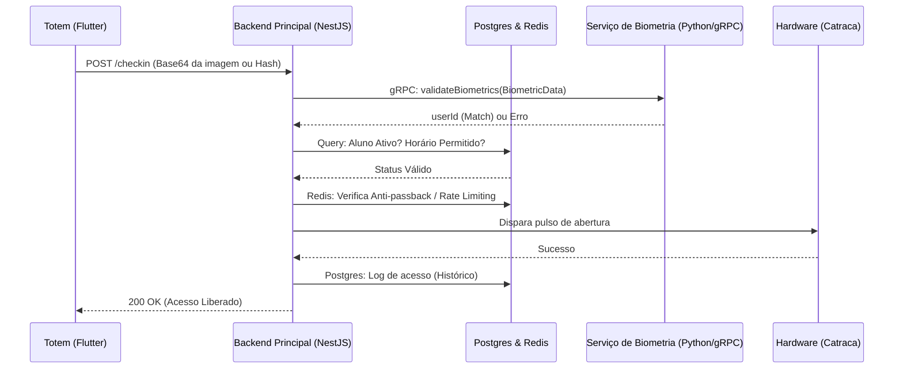

Aqui está a estruturação inicial solicitada, focada em microsserviços, LGPD e nas práticas de Clean Architecture e SOLID.

### 1. Diagrama de Arquitetura (Fluxo de Check-in)



### 2. Estrutura de Pastas (Scaffolding NestJS)
Estrutura modular, separando domínio, infraestrutura e interfaces, respeitando Clean Architecture/KISS.

```text
src/
├── app.module.ts
├── main.ts
├── checkin/
│   ├── checkin.module.ts
│   ├── controllers/
│   │   └── checkin.controller.ts
│   ├── dto/
│   │   └── checkin.dto.ts
│   ├── interfaces/
│   │   └── checkin-repository.interface.ts
│   └── services/
│       └── process-checkin.service.ts
├── hardware/
│   ├── hardware.module.ts
│   └── services/
│       └── hardware.service.ts
├── infrastructure/
│   ├── grpc/
│   │   └── biometrics.contract.ts
│   ├── hardware/
│   │   └── hardware.interface.ts
│   └── logger/
│       └── logger.contract.ts
└── students/
    ├── students.module.ts
    ├── controllers/
    │   └── students.controller.ts
    ├── dto/
    │   └── create-student.dto.ts
    └── services/
        └── student.service.ts
```

### 3. Contrato da API (TypeScript / gRPC)
Definição clara da comunicação entre o NestJS e o serviço Python de biometria.

```typescript
// src/infrastructure/grpc/biometrics.contract.ts

export interface BiometricMatchRequest {
  /** Base64 da imagem ou Hash biométrico pré-processado */
  biometricData: string;
  /** Tipo de biometria sendo validada */
  type: 'FACE' | 'FINGERPRINT';
}

export interface BiometricMatchResponse {
  /** Verdadeiro se o match foi bem-sucedido */
  success: boolean;
  /** ID do aluno em caso de sucesso (UUID) */
  userId?: string;
  /** Nível de confiança do match (ex: 0.95) */
  confidenceScore?: number;
  /** Mensagem de erro caso success seja false */
  message?: string;
}

export interface BiometricsGrpcService {
  validateBiometrics(data: BiometricMatchRequest): Promise<BiometricMatchResponse>;
}
```

### 4. Código Base: Serviço de Validação de Check-in (NestJS)
Implementação respeitando SOLID (SRP, DIP) e tratamento centralizado de erros.

```typescript
// src/checkin/services/process-checkin.service.ts

import { Injectable, Inject, UnauthorizedException, ForbiddenException, InternalServerErrorException } from '@nestjs/common';
import { BiometricsGrpcService } from '../../infrastructure/grpc/biometrics.contract';
import { CheckinRequestDto } from '../dto/checkin.dto';
import { ICheckinRepository } from '../interfaces/checkin-repository.interface';
import { IHardwareService } from '../../infrastructure/hardware/hardware.interface';
import { StudentService } from '../../students/services/student.service';
import { AbstractLoggerService } from '../../infrastructure/logger/logger.contract';

@Injectable()
export class ProcessCheckinService {
  constructor(
    @Inject('BiometricsGrpcService')
    private readonly biometricsService: BiometricsGrpcService,
    @Inject('StudentService')
    private readonly studentService: StudentService,
    @Inject(IHardwareService)
    private readonly hardwareService: IHardwareService,
    @Inject(ICheckinRepository)
    private readonly checkinRepository: ICheckinRepository,
    @Inject('LoggerService')
    private readonly logger: AbstractLoggerService,
  ) {}

  async execute(dto: CheckinRequestDto): Promise<{ message: string; userId: string }> {
    this.logger.log(`Iniciando check-in via ${dto.type}`, 'ProcessCheckinService');

    // 1. Validação Biológica via gRPC
    const matchResponse = await this.biometricsService.validateBiometrics({
      biometricData: dto.biometricData,
      type: dto.type,
    });

    if (!matchResponse.success || !matchResponse.userId) {
      this.logger.warn('Falha no reconhecimento', 'ProcessCheckinService');
      throw new UnauthorizedException('Usuário não reconhecido. Tente novamente.');
    }

    const userId = matchResponse.userId;

    try {
      // 2. Validação de Regras de Negócio
      const studentStatus = await this.studentService.getStudentStatus(userId);
      if (!studentStatus.isActive) {
        await this.logFailedCheckin(userId, 'Plano inativo');
        throw new ForbiddenException('Acesso Negado: Plano inativo.');
      }

      const isTimeAllowed = await this.studentService.isCheckinAllowedAtCurrentTime(userId, studentStatus.planId);
      if (!isTimeAllowed) {
        await this.logFailedCheckin(userId, 'Horário não permitido');
        throw new ForbiddenException('Acesso Negado: Horário não permitido para este plano.');
      }

      // 3. Liberação Física
      const isTurnstileOpened = await this.hardwareService.openTurnstile();
      if (!isTurnstileOpened) {
        throw new InternalServerErrorException('Falha de comunicação com a catraca.');
      }

      // 4. Registro de Histórico
      await this.checkinRepository.logCheckin({
        studentId: userId,
        timestamp: new Date(),
        status: 'SUCCESS',
      });

      this.logger.log(`Check-in liberado: ${userId}`, 'ProcessCheckinService');

      return {
        message: 'Acesso Liberado',
        userId: userId,
      };

    } catch (error) {
      if (error instanceof UnauthorizedException || error instanceof ForbiddenException) {
        throw error;
      }
      this.logger.error(`Erro interno: ${userId}`, error.stack, 'ProcessCheckinService');
      throw new InternalServerErrorException('Erro ao processar check-in.');
    }
  }

  private async logFailedCheckin(userId: string, reason: string): Promise<void> {
    await this.checkinRepository.logCheckin({
      studentId: userId,
      timestamp: new Date(),
      status: 'FAILED',
      reason,
    }).catch(e => this.logger.error(`Erro ao logar falha para ${userId}`, e.stack, 'ProcessCheckinService'));
  }
}
```