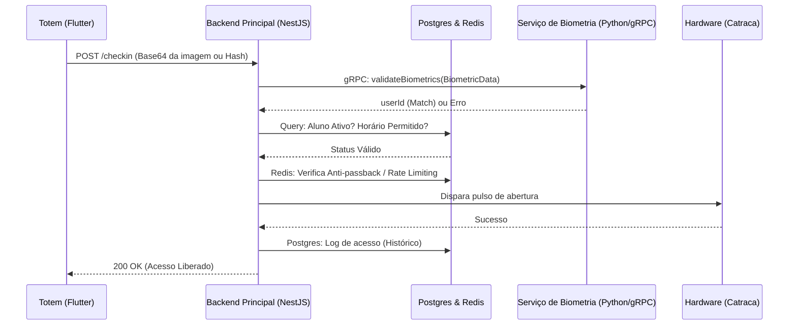

# Arquitetura do Sistema de Check-in Biométrico

## Fluxo de Dados e Componentes

A arquitetura do sistema segue um modelo de microsserviços, integrando hardware (totens/catracas) com serviços de processamento biométrico e regras de negócio, com foco em escalabilidade, segurança e aderência à LGPD.

### 1. Totem de Recepção (Frontend - Flutter)
- **Responsabilidade:** Interface com o usuário final no estúdio/academia. Captura a imagem facial ou digital (hardware biométrico USB/Integrado).
- **Ação de Check-in:** Envia os dados biométricos puros (ou pré-processados) para a API. Pode se comunicar diretamente com o serviço de biometria para otimização de banda ou passar pelo Backend Principal. O recomendado para segurança é passar pelo API Gateway/Backend Principal.

### 2. API Gateway / Backend Principal (Node.js + NestJS)
- **Responsabilidade:** Orquestração, regras de negócio, autorização, comunicação com banco de dados e controle de catraca.
- **Fluxo de Validação:**
    1. Recebe a requisição de check-in (imagem/vetor) do Totem.
    2. Envia a imagem/vetor para o Microsserviço Python via **gRPC** para identificação.
    3. Recebe o `studentId` do Microsserviço Python (ou erro de match).
    4. Consulta o Banco de Dados (PostgreSQL) para verificar os dados do `studentId` (plano ativo, horários permitidos).
    5. Utiliza o Redis para verificar regras de "anti-passback" e rate limiting.
    6. Se validado com sucesso: Invoca o `HardwareProvider` para disparar o comando de abertura da catraca.
    7. Registra o evento no histórico do banco e retorna sucesso para o Totem.

### 3. Microsserviço de Biometria (Python)
- **Responsabilidade:** Processamento intensivo de visão computacional (OpenCV, DeepFace) e/ou processamento de hashes biométricos.
- **Comunicação:** Recebe chamadas **gRPC** do Backend Principal (alta performance, tipagem forte, baixo overhead).
- **Segurança (LGPD):** Não armazena dados nominais, trabalha apenas com a vetorização/embeddings faciais e IDs anônimos. Na persistência, os embeddings são criptografados ou mantidos em bancos vetoriais dedicados com acesso restrito.

### 4. Armazenamento de Dados
- **PostgreSQL:** Armazena dados relacionais dos alunos (dados cadastrais, planos, pagamentos) e logs estruturados de acessos.
- **Redis:** Gerenciamento de cache rápido, estado da catraca, sessões temporárias e filas (caso o processamento biométrico exija processamento assíncrono em picos de acesso).

## Diagrama de Sequência do Check-in

