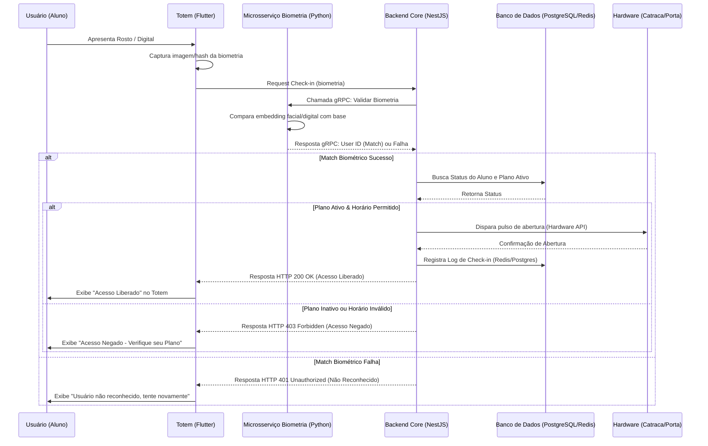

# Arquitetura do Sistema de Check-in Biométrico

Este documento descreve a arquitetura do sistema de check-in automatizado para academias e estúdios de pilates, utilizando biometria facial e digital.

## Visão Geral

O sistema é composto por três componentes principais:
1.  **Totem / Recepção (Frontend):** Desenvolvido em Flutter, responsável por interagir com o usuário e capturar a biometria.
2.  **Microsserviço de Biometria:** Desenvolvido em Python, responsável por processar e validar a identidade (match biométrico).
3.  **Backend Principal (Core):** Desenvolvido em Node.js com NestJS, responsável pelas regras de negócio, validação de planos de alunos e integração com o hardware da catraca.

## Diagrama de Fluxo de Dados (Mermaid)

## Detalhamento dos Componentes

### 1. Totem / Frontend (Flutter)
- Roda em tablets ou totens dedicados na entrada.
- Possui integração nativa com câmeras para captura facial ou leitores biométricos USB.
- Envia os dados (imagem base64 ou hash biométrico bruto) para o Backend Core.

### 2. Microsserviço de Biometria (Python)
- Escolha da tecnologia: Python é ideal devido ao rico ecossistema de visão computacional e machine learning (OpenCV, DeepFace, dlib).
- Comunicação: Utiliza **gRPC** para comunicação de alta performance e baixa latência com o backend NestJS.
- Segurança: Armazena e compara apenas os vetores faciais (embeddings) e não as fotos reais, respeitando a LGPD.

### 3. Backend Core (NestJS)
- Orquestrador principal da aplicação.
- Implementa Clean Architecture (ou modularidade forte do NestJS).
- Utiliza **PostgreSQL** para dados persistentes (Alunos, Planos, Histórico de Check-ins) e **Redis** para caching de status de usuários frequentes, rate limiting e filas, se necessário.
- Encapsula a lógica de negócio: O aluno está matriculado? O plano está em dia? O horário atual corresponde ao agendamento (pilates) ou horário de funcionamento (academia)?
- Abstrai a interface com o hardware físico (envio de sinais MQTT, requisições HTTP para a controladora da catraca ou comunicação serial).

## LGPD e Segurança
- As imagens brutas capturadas no totem NÃO são salvas permanentemente. São processadas para extração do vetor (embedding) e descartadas.
- O banco de dados armazena os embeddings biométricos utilizando criptografia.
- Comunicação entre todos os nós (Totem -> Node -> Python) é feita via TLS/SSL.